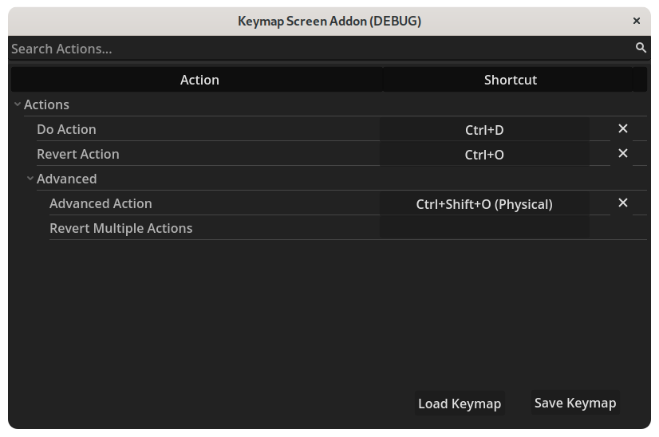

# Keymap Screen Addon  

A dialog to configure shortcuts. It's primarily made for usage inside of applications, but can be used inside games as well.

Supports searching, sub-sections, conflict resolution and clearing and resetting shortcuts.

## Screenshot



## Usage

Download a [realase](https://github.com/Jummit/keymap-screen/releases) and put it into your addons folder.

Set `keymap` to a dictionary with actions and sub-entries.

**Example:**

```gdscript
keymap = {
	Section = {
		"Action Name": "action_name",
		"SubSection": {
			"Another Action": "another_action",
		}
	}
}
```

The edited keymap can be saved and loaded as json files using `save_keymap` and `load_keymap`.

## License

The code is licensed under GPL 3.0 or later. Assets and non-code files are licensed under CC0 1.0.

This project is REUSE compliant.
