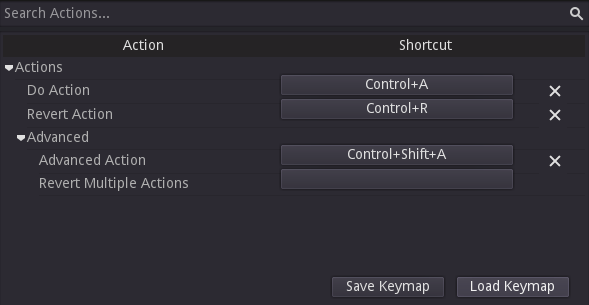

# Keymap Screen Addon



A dialog to configure shortcuts. Mostly for usage inside of applications, but can be used inside games as well.

Supports searching, sub-sections, conflict resolution and clearing and resetting shortcuts.

## Usage

Set `keymap` to a dictionary with action and sub-entries.

Example:

```gdscript
keymap = {
	Section = {
		"Action Name": "action_name",
		SubSection = {
			"Another Action": "another_action",
		}
	}
}
```

The edited keymap can be saved and loaded as json files using `save_keymap` and `load_keymap`.
